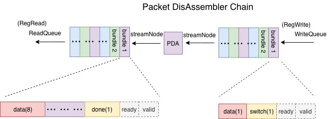

# PDA_Chain
 PDA_Chain connects a packet disassembler back to Rocketchip. By using C code, the output of PA chain is sent bundle by bundle to an asynchronous FIFO. Then, the FIFO is connected to the packet disassembler. The other side of the packet disassembler is connected to another asynchronous FIFO, which serves as a purpose of checking the result. The process is quite similar to PA chain. The diagram of PDA chain is illustrated below:
 
 
 ## Input and Output Ports
Connection among stream nodes:
```
readQueue.streamNode := packet.streamNode := writeQueue.streamNode
```
* `writeQueue` is the FIFO at the input side of the packet disassembler. `readQueue` is the FIFO at the output side of the packet disassembler. 

## Tests
To do the C-based top level test for Packet Assembler Chain:
* Build the project: first enter folder `fa18-ble/verisim` and change line 5 of ``Makefile`` to 
```
PROJECT ?= PacketDisAssembler
```
* Then go to folder `fa18-ble/tests` and change line 6 of ``Makefile`` to 
```
PROGRAMS = pds
```
* Then type `make` in the tests folder to generate the .riscv file corresponding to the C code.

* Go back to folder `fa18-ble/verisim` and type `make debug` to apply the TestHarness and create the executable for the C tester file.
* The last step is to type 
```
./simulator-freechips.rocketchip.system-DefaultConfig-debug ../tests/pda.riscv
```
to run the project on the RocketChip.
* You can also generate a waveform for debugging by typing 
```
./simulator-freechips.rocketchip.system-DefaultConfig-debug -vout.vcd ../tests/pda.riscv
```
